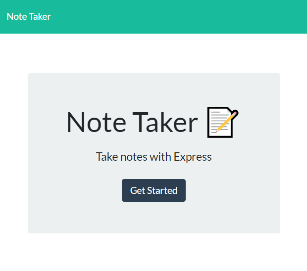
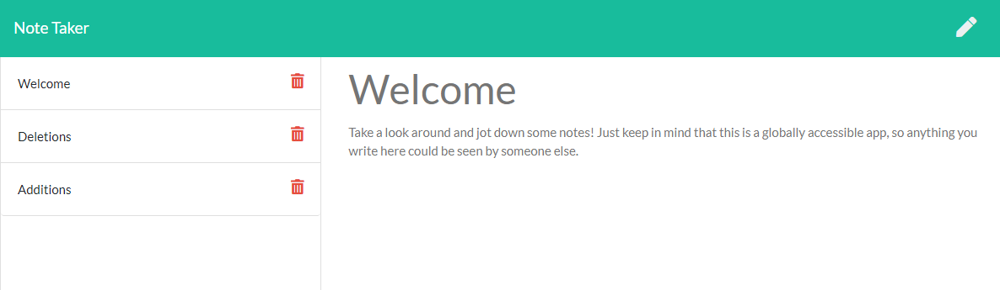

# Team Profile Generator

## Table of Contents
- [Project Overview](#project-overview) 
- [Live Application](#live-application)
- [License](#license)
- [Screenshots](#screenshots)

## Project Overview
Full-stack application for creating, saving and deleting notes. Functionality is achieved by a combination of front-end (index.js) and back-end (server.js) logic to accept user inputs and serve appropriate responses in the form of notes or deletions. The application leverages Node.js and Express.js and is hosted in Heroku.

### Languages Used
- JavaScript (Node.js & Express.js)
- HTML
- CSS

### Libraries Used
- [Express.js](https://www.npmjs.com/package/express)
- [Path](https://www.npmjs.com/package/path)
- [ShortID](https://www.npmjs.com/package/shortid)
- [Bootstrap](https://getbootstrap.com/)

## Live Application
https://captain63-express-note-taker.herokuapp.com/

## License
Permission is hereby granted, free of charge, to any person obtaining a copy of this Software and associated documentation files (the "Software"), to deal in the Software without  restriction, including without limitation the rights to use, copy, modify, merge, publish distribute, sublicense, and/or sell copies of the Software, and to permit persons to whom the Software is furnished to do so, subject to the following conditions.

[View the full license](./LICENSE).

## Screenshots

